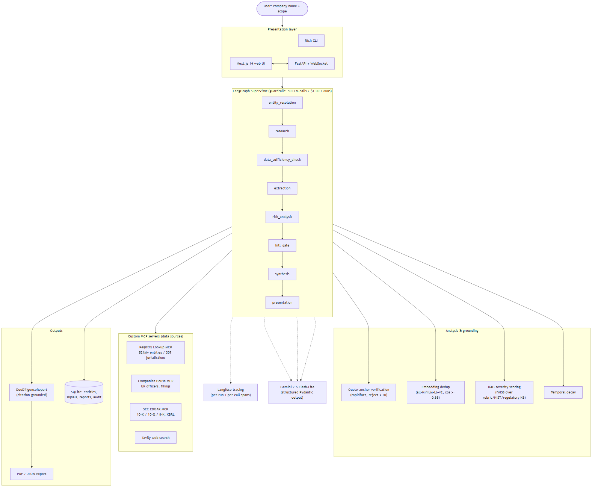

<!-- The YAML header above is Hugging Face Space metadata (Docker SDK, app port,
     hardware). HF strips it and renders everything below as the Space page. It
     is harmless when the repo is viewed on GitHub. -->

# Agentic Due Diligence Intelligence Platform

### 🔗 Live demo — **[lp012-due-diligence-platform.hf.space](https://lp012-due-diligence-platform.hf.space)**

[](https://lp012-due-diligence-platform.hf.space)
[](LICENSE)

> Hosted on the Hugging Face free tier (US region) — if it's been idle it sleeps,
> so give it ~30–60s to wake on first load.

> Autonomous multi-agent system that researches a company across **521M+ global
> entities**, extracts **quote-verified** risk signals with an LLM, and synthesizes
> a **citation-grounded** due-diligence report — in **~3–4 minutes for 1–2¢**, not
> weeks of analyst time.

Point it at any company name. A LangGraph supervisor orchestrates eight pipeline
stages that resolve the entity, gather evidence from custom MCP data sources
(corporate registries, Companies House, SEC EDGAR, web search), extract risk
signals, verify every quote against its source, dedupe and score severity against
a RAG-grounded rubric, pause for human review on critical findings, and write a
report where **every sentence cites the signal it came from**.

---

## Architecture



The pipeline is a fixed LangGraph DAG (no agent free-for-all), wrapped in hard
guardrails (≤ 50 LLM calls, ≤ $1.00, ≤ 600 s) and a single Langfuse trace per run.
Diagram source: [`docs/architecture.mmd`](docs/architecture.mmd).

---

## Key features

- **Four custom MCP servers** — Registry Lookup (global registries), Companies
  House (UK officers/filings), SEC EDGAR (10-K/10-Q/8-K + XBRL), and News
  (NewsAPI.org — lawsuits, investigations, reputational events), alongside
  Tavily web search. New data sources plug in with zero agent-code changes. See
  [`docs/mcp_servers.md`](docs/mcp_servers.md).
- **Quote-verified claims** — every extracted signal carries a verbatim
  `source_snippet` that is fuzzy-matched back to the source text (`rapidfuzz`);
  below-threshold snippets are rejected and logged, borderline ones are kept
  with confidence halved.
- **Wrong-company guard** — open-web documents (search results, news, the
  heuristically-guessed company website) must actually mention the resolved
  entity's name or an alias before they enter extraction, so a similarly-named
  company can't contaminate the report. ID-keyed sources (registry, Companies
  House, SEC EDGAR) are structurally bound to the entity already.
- **Source-credibility weighting & severity gate** — quote-anchoring proves a claim
  is *on the page*; this proves the *page is trustworthy*. Every signal is graded
  by source trust (PRIMARY registries/SEC/court · ESTABLISHED reputable outlets ·
  GENERAL · LOW PR-wires/blogs/UGC) and independent cross-source corroboration. A
  HIGH/CRITICAL finding resting on a single low-credibility, uncorroborated source
  is capped to MEDIUM, flagged `unverified`, and routed to human review — so
  planted/fake content can't drive a headline risk. Fully deterministic: no extra
  LLM calls, latency, or cost ([`source_credibility.py`](src/analysis/source_credibility.py)).
- **Citation-grounded synthesis** — report sentences reference `[Signal-N]` IDs;
  orphan citations are detected and flagged (faithfulness floor).
- **RAG-grounded severity** — severity is scored against a FAISS-indexed
  knowledge base (custom rubric with company-size proportionality, NIST CSF,
  and US **and international** regulatory references — SEC/OFAC/GDPR plus
  UK FCA/ICO/SFO, EU competition/DSA/DMA, India RBI/SEBI/ED, and global
  sanctions/debarment lists), not vibes.
- **Embedding deduplication** — near-duplicate signals (cosine ≥ 0.85,
  `all-MiniLM-L6-v2`) collapse into one primary + corroborating links; corroborated
  signals get a confidence boost.
- **Human-in-the-loop gate** — pauses on CRITICAL/low-confidence signals (CLI or
  browser); a configurable timeout auto-proceeds as `PENDING_REVIEW` and never
  auto-confirms a CRITICAL finding.
- **Private-company aware, jurisdiction-honest** — a data-sufficiency tier
  (RICH/ADEQUATE/LIMITED/SPARSE) drives an explicit caveat when public data is
  thin. Depth is deliberately jurisdiction-aware: US public filers get the
  deepest layer (SEC EDGAR + XBRL), UK companies get Companies House
  officers/filings, and other jurisdictions rely on registry + web/news — with
  the sufficiency tier disclosing thinner coverage instead of hiding it.
- **Three interfaces** — Rich CLI, FastAPI + WebSocket backend, and a Next.js 14
  dashboard (radar chart, filterable signals, browser HITL, PDF/JSON export).
- **Full observability** — every agent span, MCP call, and LLM generation is
  traced in Langfuse with per-run cost/latency metrics.

---

## Quick start

```bash
# 1. install (Python 3.11+)
pip install -e .                       # add ".[web]" for the API, ".[pdf]" for PDF export

# 2. add API keys (all have free tiers)
cp .env.example .env                   # TAVILY_API_KEY, GOOGLE_API_KEY, REGISTRY_LOOKUP_API_KEY, COMPANIES_HOUSE_API_KEY

# 3. run an assessment
ddp "Boeing" --auto --verbose          # or: python -m src.main "Stripe" --auto
```

CLI flags: `--scope {full,financial,compliance}`, `--auto` (skip HITL),
`--no-cache`, `--hitl-timeout SECONDS`, `--pdf`, `--verbose`.

### Web UI

```bash
pip install -e ".[web]" && ddp-api --reload      # backend → http://localhost:8000 (docs at /docs)
cd frontend && npm install && npm run dev        # UI → http://localhost:3000 (proxies /api + /ws)
```

The Next.js dev server proxies `/api` and `/ws` to `BACKEND_ORIGIN` (default
`http://localhost:8000`), so no CORS setup is needed. Pages: company search +
entity confirmation → live pipeline progress (WebSocket) → browser HITL review →
report dashboard (radar chart, filterable signals, strengths, sources, PDF/JSON
export) → run history.

| Method | Path | Purpose |
|---|---|---|
| `POST` | `/api/assess` | Launch an assessment → `{run_id}` |
| `GET` | `/api/runs/{id}` | Live status (`researching`/`extracting`/`analyzing`/`reviewing`/`complete`) |
| `GET` | `/api/runs/{id}/report` | Full due-diligence report JSON |
| `GET` | `/api/runs/{id}/signals` | Risk signals (filter by `category`/`severity`, paginated) |
| `POST` | `/api/runs/{id}/review` | Submit a HITL verdict (`confirm`/`dismiss`/`investigate`) |
| `GET` | `/api/runs/{id}/export/pdf` · `/export/json` | Download report |
| `WS` | `/ws/{id}` | Real-time progress stream |

### Run with Docker

A multi-stage build compiles the Next.js static export and serves it together
with the FastAPI backend from one slim Python image on a single origin.

```bash
cp .env.example .env                       # 1. add your API keys
docker compose up --build                  # 2. build + run → http://localhost:8000
docker compose --profile monitoring up     # 3. (optional) + self-hosted Langfuse on :3000
```

The app reads keys from `.env` (never baked into the image) and persists the
SQLite store, exports, and the embedding-model cache via named volumes. Langfuse
is optional — the project defaults to Langfuse Cloud; the `monitoring` profile
spins up a self-hosted instance on a shared network instead.

---

## How it works

1. **Entity resolution** — registry search → canonical name, jurisdiction,
   aliases, public/private, SEC CIK; cached 7 days.
2. **Research** — all MCP sources called concurrently (`asyncio.gather`,
   `return_exceptions=True`); a failed source is recorded, never fatal. Open-web
   results that never mention the resolved entity are dropped (wrong-company guard).
3. **Data-sufficiency check** — classifies coverage into RICH/ADEQUATE/LIMITED/
   SPARSE from doc count × source-type diversity.
4. **Extraction** — per-document structured LLM extraction into `RiskSignal`
   objects (≤ 7/doc), each quote-anchor verified; temporal decay applied.
5. **Risk analysis** — dedupe (counting independent source domains) → source-
   credibility weighting → RAG-retrieve rubric context → LLM severity score →
   contradiction detection → credibility severity-gate (cap + flag single
   low-trust, uncorroborated HIGH/CRITICAL findings).
6. **HITL gate** — interrupt on CRITICAL/low-confidence (auto mode tags
   `PENDING_REVIEW`).
7. **Synthesis** — per-category sections + executive summary with inline
   `[Signal-N]` citations + recommended actions + category scores.
8. **Presentation** — Rich CLI / web dashboard / PDF / JSON; all persisted to
   SQLite with a full audit log.

---

## Evaluation results

Live runs against the deployed Hugging Face Space (US region, 2026-06-27, commit
`b799912`), scored by [`evaluation/run_eval.py`](evaluation/run_eval.py) against
the Phase-0 manual baseline (semantic matching, `all-MiniLM-L6-v2`, cosine ≥ 0.45).
These supersede the earlier dev-machine runs for two reasons: (a) the Registry
Lookup API is Cloudflare-blocked (HTTP 403) from the dev region but reachable from
the US-hosted Space, so the registry source contributes on every run; and (b) a
resolver fix now resolves a SEC CIK for public companies, re-enabling SEC EDGAR
enrichment — Boeing resolves `is_public=true` / CIK 0000012927 and reaches RICH
data sufficiency, while the News MCP source lifts document diversity across the board.

| Company | Signals | Recall vs human | Precision-proxy | Severity exact | Data sufficiency | Cost | Latency |
|---|---|---|---|---|---|---|---|
| Boeing (3 runs) | 39–53 | 58–75% | 51–59% | 43–44% | **RICH** | ~$0.015–0.021 | ~2.0–3.8 min |
| Stripe (private) | 35 | **71%** | 74% | 40% | RICH | ~$0.012 | ~2.7 min |
| Chime (private) | 15 | **100%** | 80% | 50% | RICH | ~$0.011 | ~2.5 min |

**Aggregate (5 runs):** mean recall **76%** · latency **p50 164 s / p95 216 s** ·
avg cost **~$0.015** · guardrail compliance **100%** · verification rejection 0%.

**RAGAS (LLM judge, Boeing live):** faithfulness **90%** · context-precision
**100%** · answer-relevancy **50%** — implemented natively against the project's
own Gemini provider + embeddings ([`evaluation/ragas_eval.py`](evaluation/ragas_eval.py)),
since the published `ragas` package's import is broken against the installed
langchain stack. (LLM-judge metrics vary run-to-run; faithfulness is corroborated
by 0 orphan citations across all live runs.)

**Consistency (3 live Boeing runs):** mean Jaccard **0.54** (min 0.44, target ≥ 0.80).

### System vs. human analyst

| | Human (30 min/company) | System |
|---|---|---|
| Boeing | 12 major risks | 7–9 of 12 recovered + ~39–53 granular signals |
| Stripe | 7 risks | 5 of 7 recovered at 74% precision-proxy |
| Time | ~30 min | ~3 min |
| Cost | analyst time | ~1¢ |

Full write-up: [`evaluation/system_vs_human.md`](evaluation/system_vs_human.md).

> **Honest open items:** (1) severity calibration remains the weakest dimension
> (severity exact-match ~44%; the rubric scorer is conservative vs. the human's
> CRITICAL-heavy labels); and (2) run-to-run consistency (0.54 Jaccard) has
> improved but is still below the 0.80 target. (A prior resolver regression that
> mis-flagged public companies as private — disabling SEC EDGAR enrichment — has
> been fixed in [`entity_resolver.py`](src/resolution/entity_resolver.py) and
> verified live: EDGAR CIK resolution now runs for every US/unknown entity, guarded
> by a first-token name match so private companies aren't mis-bound, e.g.
> Stripe→Stride, so Boeing resolves a CIK and reaches RICH.) These are documented
> rather than hidden.

---

## Cost analysis

| Item | Value |
|---|---|
| Cost per assessment | **~$0.011–0.021 as recorded** (avg ~$0.015; Gemini 2.5 Flash-Lite, structured output)* |
| LLM-call guardrail | 50 calls/run hard cap (synthesis reserved) |
| Cost guardrail | $1.00/run hard cap → pipeline degrades to a partial report |
| Data sources | All free tier: Tavily (1k/mo), Registry Lookup (5k/mo), Companies House (unlimited), SEC EDGAR (free) |
| Human equivalent | ~30 analyst-minutes/company |

\* Recorded figures come from the run-time estimator, which at eval time priced
Flash-Lite at Flash rates; true billed cost is ~⅓ higher (avg ~2¢/run). The
estimator now carries Flash-Lite's real pricing ($0.10 in / $0.40 out per 1M
tokens), so future runs report the corrected number.

At 1–2¢ and ~3 min per company, the platform is ~3 orders of magnitude cheaper
than manual research while preserving an auditable evidence trail.

---

## Tech stack & rationale

| Layer | Choice | Why |
|---|---|---|
| Orchestration | **LangGraph** | Explicit, inspectable state-machine DAG with built-in interrupts for HITL — not an opaque agent loop. |
| Data sources | **MCP** (custom servers) | Tool/data access is decoupled from agents; a new source is a new server, zero agent changes. |
| LLM | **Gemini 2.5 Flash-Lite** | Native structured (Pydantic) output, generous free tier, low cost/latency. Both tiers default to Flash-Lite (the evaluated config); the fast/smart split is wired, so promoting judgment calls to Pro is a one-line env change. |
| Verification | **rapidfuzz** | Deterministic quote-anchor matching → no hallucinated claims survive. |
| Dedup / embeddings | **sentence-transformers** (`all-MiniLM-L6-v2`) | Local, free, fast semantic similarity for dedup + eval matching. |
| Severity grounding | **FAISS** RAG | Severity decisions grounded in an indexed rubric/NIST/regulatory KB. |
| Storage | **SQLite** (`aiosqlite`) | Zero-ops async persistence + audit log + caching. |
| Observability | **Langfuse** | Per-run trace with nested agent/MCP/LLM spans and cost metrics. |
| Backend / UI | **FastAPI + WebSocket / Next.js 14** | Live progress streaming + a portfolio-grade dashboard. |

---

## Design decisions

**Why LangGraph (not a free-form agent loop)?** Due diligence needs auditability
and bounded cost. A fixed DAG with explicit guardrail checks means 0 redundant
agent calls, deterministic orchestration, and native `interrupt()` support for
the human-in-the-loop gate — properties an autonomous ReAct loop can't guarantee.

**Why MCP (not hardcoded API clients)?** The portfolio thesis is extensibility:
each data source is an independent MCP server with typed tools. The News API
server is the worked proof — it was added by writing one server and a single
line in the research agent's source map, with zero changes to agent logic. It
also keeps credentials and rate-limit/backoff logic isolated per source.

**Why not CrewAI / AutoGen?** Role-playing multi-agent frameworks optimize for
emergent collaboration, the opposite of what a compliance-grade pipeline wants.
Here the "agents" are deterministic graph nodes with hard budgets and verifiable
I/O contracts; CrewAI's autonomy would add cost variance and remove the
inspectable state machine that makes the output trustworthy.

**Why quote-anchor verification?** The biggest risk in LLM due diligence is
fabricated findings. Requiring a verbatim source snippet that must fuzzy-match
the fetched text turns "trust the model" into "verify against the source," and
makes the rejection rate a measurable quality signal.

**How do you handle fake or low-credibility sources?** Quote-anchoring only proves
a claim is *on the page* — not that the *page* is truthful, so a planted article
would still pass it. A deterministic source-credibility layer closes that gap: each
signal is graded into a trust tier (PRIMARY registries/SEC/court · ESTABLISHED
reputable outlets · GENERAL · LOW PR-wires/blogs/UGC) and corroboration is counted
across *independent registrable domains* (five mirrors of one wire story collapse to
one). Trust haircuts the confidence score (which flows into category scores), and a
hard gate **caps + flags** any HIGH/CRITICAL finding that rests on a single
low-credibility, uncorroborated source — capping it to MEDIUM, marking it
`unverified`, and routing it to human review. It is never dropped, so recall is
preserved, and a single PRIMARY source (or ≥2 independent reputable domains) is left
untouched. On a live Boeing run this graded 80 signals PRIMARY/GENERAL/LOW/ESTABLISHED
and flagged 19 single-low-trust claims for review, with **no change to recall or
precision** and **zero added LLM cost** (it is pure tier lookup + the existing dedup
embeddings).

---

## Project layout

```
src/            supervisor + agents, models, mcp_servers, analysis, resolution,
                verification, storage, presentation, llm
api/            FastAPI backend (REST + WebSocket + HITL bridge)
frontend/       Next.js 14 web UI (App Router, TS, Tailwind, recharts)
knowledge_base/ severity rubric, NIST CSF, regulatory reference (FAISS-indexed)
evaluation/     run_eval.py, metrics.py, ragas_eval.py, ground_truth/, results
tests/          pytest suite (unit + integration markers)
docs/           architecture diagram + MCP server docs
```

Run the suite: `pytest -q -m "not integration"`. See
[`frontend/INTEGRATION.md`](frontend/INTEGRATION.md) for the web E2E tests and
[`evaluation/README.md`](evaluation/README.md) for the evaluation harness.

---

## License

MIT © Laaksh Parikh
